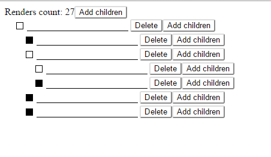

# Hiearchical Checklist.

Classic hierarchical checklist example, which you could often see in installers. 
This is checklist with a rule. Item is checked, if all children are checked. 

62 SLOC for jsx components, 26 for the model definition.

This example demonstrates unidirectional data flow with mutable state, pure render optimisation, and two-way data binding.

